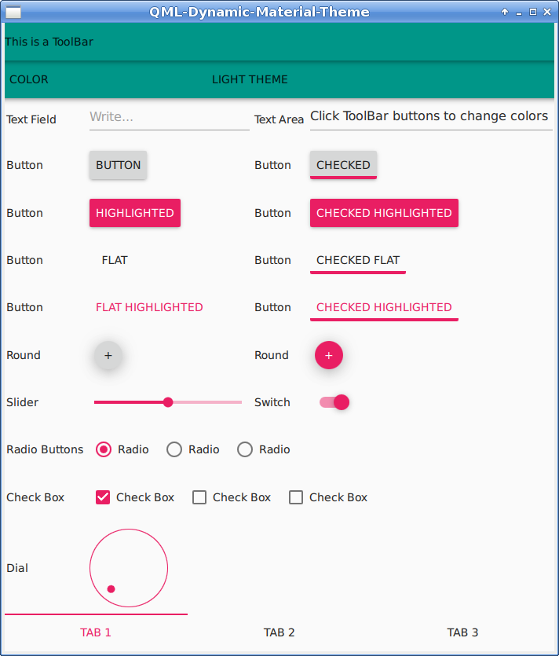
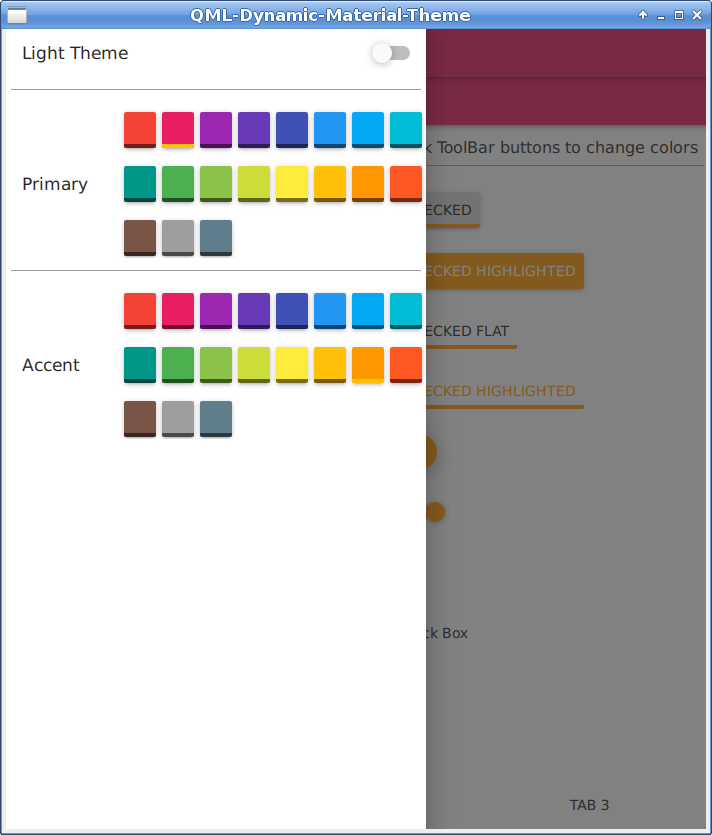
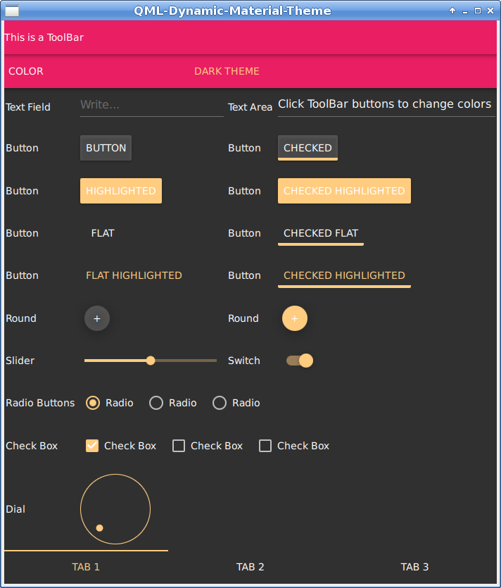

# QML-Dynamic-Material-Theme
Demonstrate how to change Material colors and Theme at runtime with QML

The behaviour of the checked highlighted button is a bug ([QTBUG-91886](https://bugreports.qt.io/browse/QTBUG-91886))

